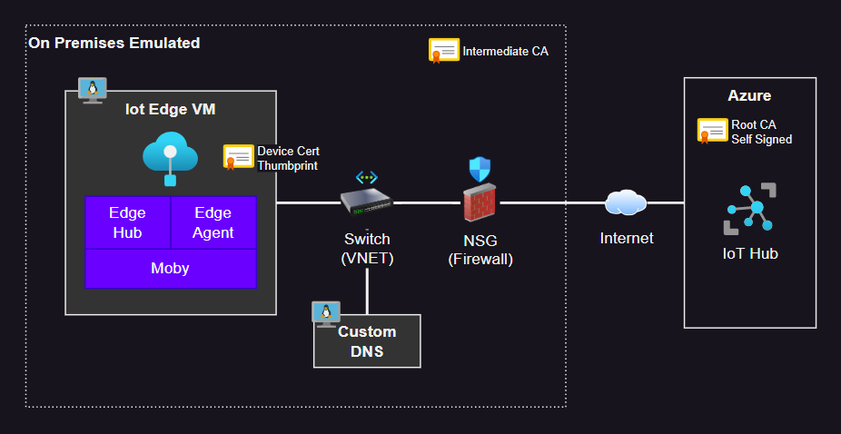

# Azure IoT Edge with Custom DNS

Azure IoT Edge runtime using a custom DNS.



## Infrastructure

### 1 - Create the resources

Generate the test-only certificate chain:

```sh
bash scripts/generateCerts.sh
```

Deploy the resources:

```sh
terraform -chdir="infra" init
terraform -chdir="infra" apply -auto-approve
```

<details>
  <summary>(Optional) Upgrade IoT Hub certificate to V2 (DigiCert)</summary>

  ```sh
  az iot hub certificate root-authority set --hub-name "iot-bluefactory" --certificate-authority v2 --yes
  ```
</details>

Make sure the EdgeGateway has completed the installation:

```sh
# Connect to the IoT Edge VM
ssh edgegateway@<public-ip>

# Check if the cloud-init status is "done", otherwise wait with "--wait"
cloud-init status

# Confirm that the IoT Edge runtime has been installed
iotedge --version
```

Restart the VM to activate any Linux kernel updates:

```sh
az vm restart -n "vm-bluefactory-edgegateway" -g "rg-bluefactory"
```

### 2 - Check the DNS provisioning

```sh
# Connect to the DNS server
ssh dnsadmin@<public-ip>

# Check if the cloud-init status is "done", otherwise wait with "--wait"
cloud-init status

# Check the DNS installation
sudo systemctl status named
```

Restart the VM to activate any Linux kernel updates:

```sh
az vm restart -n "vm-dns-edgegateway" -g "rg-bluefactory"
```

### 3 - DNS Setup

Upload the config files to the remote DNS server:

```sh
bash ./scripts/uploadBind9Config.sh
```

Connect to the DNS server and run the config script:

```sh
sudo bash dnsConfig.sh
```

Check the service status:

```sh
sudo systemctl status named
```

Testing the DNS resolution:

```sh
# Testing the EdgeGateway
dig @10.0.90.4 edgegateway.bluefactory.local

# Testing the IoT Hub
dig @10.0.90.4 iot-bluefactory.azure-devices.net
```

(OPTIONAL) You can change the DNS in the operating systems if required.

Edit `/etc/resolv.conf` and change the DNS:

```
nameserver 10.0.90.4
```

### 4 - Register the IoT Edge device

Run the script to create the IoT Hub device registration:

> ⚠️ IoT Hub supports registering IoT Edge devices only through self-signed method (certificate thumbprint). For a CA-Signed configuration, you must implement device enrollment with DPS. See [this issue](https://github.com/MicrosoftDocs/azure-docs/issues/108363) for details.

```sh
bash scripts/registerEdgeGatewayDevice.sh
```

Upload the required configuration files to the EdgeGateway device:

```
bash scripts/uploadEdgeConfig.sh
```

Connect with SSH to the EdgeGateway and execute the configuration

```sh
sudo bash edgeConfig.sh
```

Verify the results:

```sh
sudo iotedge system status
sudo iotedge system logs
sudo iotedge check
```

### 5 - Deploy the modules

Now that the device is properly registered and connected with IoT Hub, create a deployment:

```sh
az iot edge deployment create --deployment-id "gateway" \
    --hub-name $(jq -r .iothub_name infra/output.json) \
    --content "@edgegateway/deployments/gateway.json" \
    --labels '{"Release":"001"}' \
    --target-condition "deviceId='EdgeGateway'" \
    --priority 10
```

To check the deployment in the EdgeGateway device:

```sh
iotedge list
```

Check and confirm that everything is OK:

```sh
sudo iotedge check
```

## Testing the DNS

To force the DNS error, one possibility is to disable forwarding. Edit the Bind9 options:

```sh
sudo nano /etc/bind/named.conf.options
```

Disable the forwarding by setting these properties:

```options
forwarders {};

recursion no;
```

Also, add `forwarders {};` to the zone:

```sh
sudo nano /etc/bind/named.conf.local
```

Configuration should look like this:

```
zone "bluefactory.local" {
        type master;
        file "/etc/bind/db.bluefactory.local";
        notify no;
        forwarders {};
};
```

Save and restart the DNS:

```sh
# Restart the service
sudo systemctl restart named

# Check the status
sudo systemctl status named
```

This should allow only registered entries to resolve, and all others to fail.

```sh
# Testing the EdgeGateway
dig @10.0.90.4 edgegateway.bluefactory.local

# Testing the IoT Hub
dig @10.0.90.4 iot-bluefactory.azure-devices.net

# With NSLOOKUP
nslookup iot-bluefactory.azure-devices.net 10.0.90.4
```
